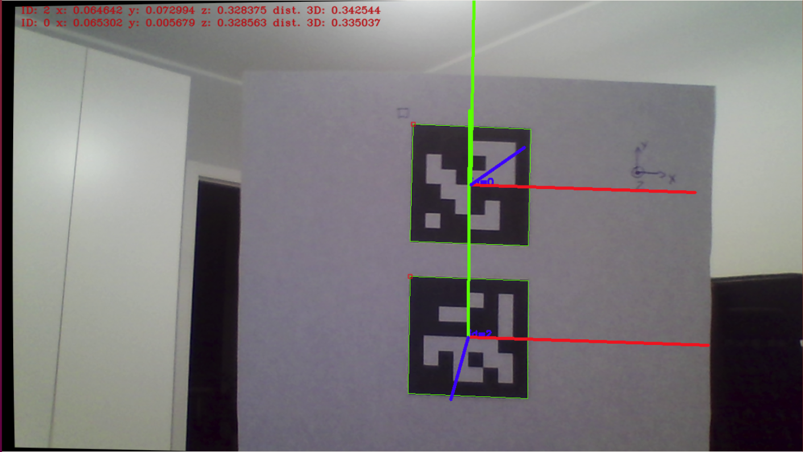

# Aruco markers class: markers generation, detection and pose estimation

This class was created to simplify the process of
usage of Aruco markers library.

## Dependencies:
Aruco class depends from:
* [openCV](https://opencv.org/)
* [Camera calibration class](https://github.com/michLab/camera)

## Aruco markers detection
<p align="center">
  
  <br>Calibration procedure
</p>

* Define side size of Aruco marker:
```c++
constexpr aruco_ns::SizeMeters marker_size_m = 0.05178f;
```
* Create Aruco class object:
```c++
aruco_ns::Aruco aruco;
aruco.set_marker_size_meters(marker_size_m);
```
* Create Camera class object to get camera images and compensate
distortions. It allows to calibrate camera if needed. Camera calibration matrix
and dist coeffs are passed to Aruco object:
```c++
camera_ns::Camera cam;
cam.set_video_source(0);
cam.set_camera_calibration_results_file_name("cam_calib.txt");
#ifdef CAM_CALIBRATE
cam.set_chessboard_dimensions(6,9);
cam.set_chessboard_square_dimension(0.0268f);
cam.set_number_of_images_to_calibrate(20);
try {
    cam.calibrate();
} catch (camera_ns::ExceptionMessage ex) {
    std::cout << ex.msg << std::endl;
}
#endif
if(cam.get_calibrated() == false) {
    try {
        cam.load_camera_calibration_data();
        aruco.set_camera_matrix(cam.get_camera_matrix());
        aruco.set_dist_coefs(cam.get_dist_coefs());
    } catch (camera_ns::ExceptionMessage ex) {
        std::cout << ex.msg << std::endl;
    }
}
```
* In loop read image, compensate distortions, detect aruco markers, draw them
and define camera pose relatibe to them:
```c++
/// Create window for showing frame with aruco markers:
cv::namedWindow("Aruco");//, CV_WINDOW_AUTOSIZE);

while (true) {
    try {
        cam.read();
        cam.compensate_distortions(camera_ns::CorrectionType::undistort);
    } catch (camera_ns::ExceptionMessage ex) {
        std::cout << ex.msg << std::endl;
    }
    /// Aruco will work on copied frame:
    cv::Mat& frame_for_aruco = cam.get_reference_to_frame_calibrated();
    if (aruco.detect(frame_for_aruco)) {
        aruco.draw_detected(frame_for_aruco);
        aruco.estimate_pose_single_markers();
        aruco.draw_axis(frame_for_aruco);
        aruco.draw_pose_info(frame_for_aruco);
    }
    cv::imshow("Aruco", frame_for_aruco);
    cv::waitKey(10);
}
```

## License
The contents of this repository are covered under the [MIT License](./LICENSE.txt)


## Contributing

1. Fork it (<https://github.com/michLab/Aruco.git>)
2. Create your feature branch (`git checkout -b feature/fooBar`)
3. Commit your changes (`git commit -am 'Add some fooBar'`)
4. Push to the branch (`git push origin feature/fooBar`)
5. Create a new Pull Request
